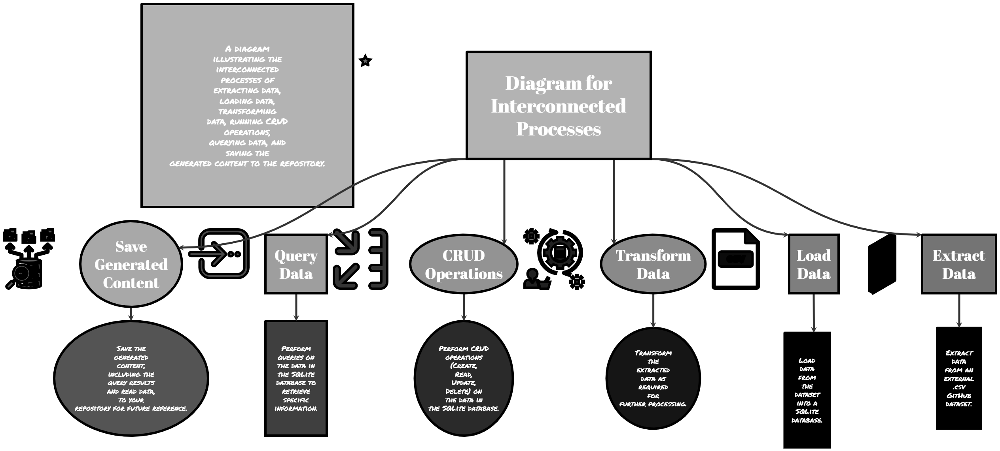
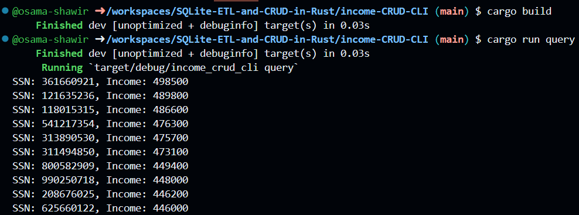
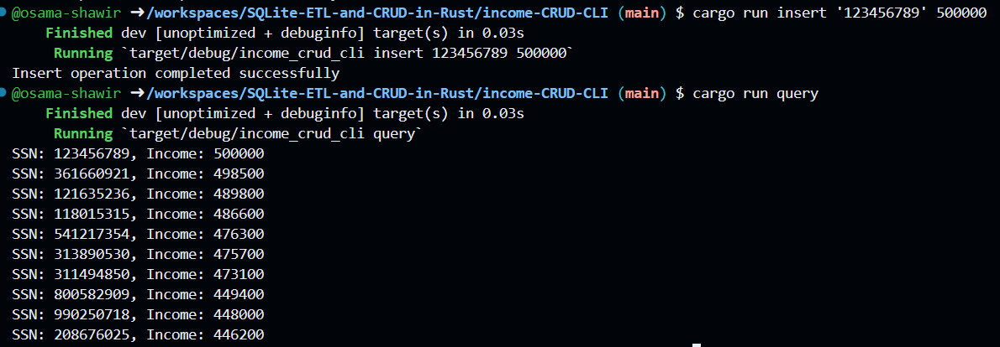
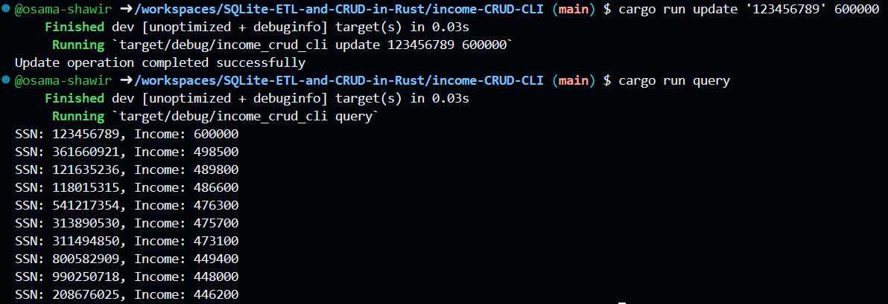
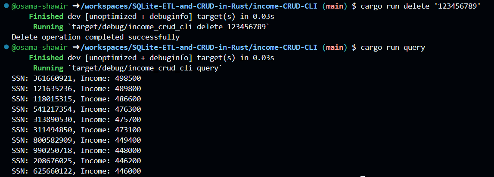
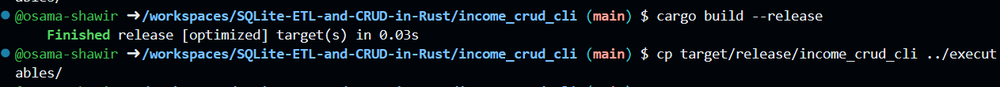

[](https://github.com/osama-shawir/Rust-CLI-Binary-with-SQLite/actions/workflows/tests.yml)
[](https://github.com/osama-shawir/Rust-CLI-Binary-with-SQLite/actions/workflows/lint.yml)

# SQLite ETL and CRUD in Rust



The SQLite ETL and CRUD project is a Rust-based command-line application designed for performing ETL (Extract, Transform, Load) operations and CRUD (Create, Read, Update, Delete) actions on an SQLite database. It offers a versatile way to interact with your database, including querying, inserting, updating, and deleting records.

- **Data**: This directory contains the input data files.

  - `sql-murder-mystery.db`: A DB file containing personal information for individuals, including their Social Security Numbers (SSN), names, addresses, and other details from which we use the income table.
 
### DB Schema:


 

## Features

- **Query Database:** Retrieve and display data from the SQLite database, with the ability to apply filtering and sorting to the results.

- **Insert Data:** Add new records to the database, allowing you to populate it with relevant information.

- **Update Records:** Modify existing records, ensuring your database remains up-to-date with the latest data.

- **Delete Records:** Remove unwanted records from the database, maintaining data accuracy.

## How to Use

To utilize this project for your SQLite database needs, follow the steps below:

1. **Clone the Repository** or run this on Codespaces
2. Navigate to income_crud_cli directory and build the program using:

```bash
cargo build
```

3. Running the Program:

Ensure that you have Rust and Cargo installed. You can download and install them from the official website.

After installation, you can run the program using the cargo run command, along with the appropriate command-line arguments to specify the action you want to perform. Here are some example commands:

### Query the Database:

To retrieve and display data, run:

```bash
cargo run -- query
```

This will execute a query and display the requested information. In our case we set it to display the information of the ten people with the highest salaries in the database.



### Insert Data:

To add new records to the database, run:

```bash
cargo run -- insert your-ssn your-annual-income
```
Replace your-ssn and your-annual-income with the appropriate values.



### Update Records:

To modify existing records, run:

``` bash
cargo run -- update your-ssn new-annual-income
```

Replace your-ssn with the SSN of the record you want to update and new-annual-income with the updated income value.



### Delete Records:

To remove records from the database, run:

```bash
cargo run -- delete your-ssn
```

Replace your-ssn with the SSN of the record you want to delete.



Enjoy the convenience of performing ETL and CRUD operations on your SQLite database with this Rust project. Keep your data organized and up-to-date effortlessly.

4. Building and Downloading Executable:

To build a Rust binary and download it from the terminal, you can use the cargo build command with the --release flag to build an optimized release binary.

```bash
cargo build --release
```

This will build an optimized release binary in the target/release directory. Afterwards, you can run the following command to move the executable to the home directory executables folder.

```bash
cp target/release/my_project ../executables/
```




## How GitHub Copilot was used to assist in building this project

GitHub Copilot is an AI programming assistant that can assist developers in building projects by providing code suggestions and completing code snippets based on the context of the code being written. In this case, GitHub Copilot was used to translate chunks of code from Python to Rust, which can be a time-consuming and error-prone process. By providing suggestions for Rust code based on the Python code, GitHub Copilot can help speed up the translation process and reduce the likelihood of errors.

In addition to translation, GitHub Copilot also assisted with debugging and proper organization of the project. By providing suggestions for code structure and organization, GitHub Copilot can helped ensure the Rust code is easy to read and maintain.

Furthermore, GitHub Copilot was used to generate boilerplate code that is needed for building CLI tools. This can save developers time and effort by automating the process of creating the basic structure of a CLI tool.

Once the Rust code is written, formatting, linting, and testing are all be automated using GitHub workflows. This helps ensure that the code is properly formatted, adheres to best practices, and is thoroughly tested before being deployed.

Overall, GitHub Copilot was a valuable tool for this Rust project, helping to speed up the coding process, reduce errors, and automate important tasks like formatting, linting, and testing.

### [Youtube Demo for the Project here](https://youtu.be/vCfCQsH-70A)

Data Source:

[SQL Murder Mystery by Knight Lab](https://github.com/NUKnightLab/sql-mysteries)
